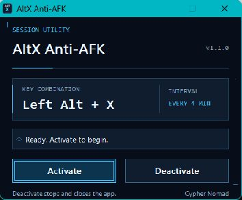

# AltX Anti-AFK

A small, portable Windows utility by **Cypher Nomad** for anti-AFK use by the Star Citizen community. Click **Activate** to send **Left Alt + X** after three seconds, then repeat it every four minutes. Click **Deactivate** to stop and close the program.

The shortcut goes to whichever application currently has keyboard focus. AltX Anti-AFK uses standard Windows keyboard input and has no game integration.

## v1.1.0 visual refresh

A dark space look with blue and cyan neon accents gives AltX Anti-AFK a fresh cockpit feel. The minimal window keeps **Activate** and **Deactivate** easy to find.

The three-second first press, four-minute repeat, keyboard input, and complete exit on Deactivate keep the same behavior. The update refreshes the interface and presentation.



## Download

Open the [latest release](https://github.com/SCCypherNomad/AltX-Anti-AFK/releases/latest) and download:

- [AltX-windows-x64.zip](https://github.com/SCCypherNomad/AltX-Anti-AFK/releases/latest/download/AltX-windows-x64.zip): the ready-to-run Windows program and instructions.
- [AltX-source.zip](https://github.com/SCCypherNomad/AltX-Anti-AFK/releases/latest/download/AltX-source.zip): source code, assets, and build scripts.
- [SHA256SUMS.txt](https://github.com/SCCypherNomad/AltX-Anti-AFK/releases/latest/download/SHA256SUMS.txt): checksums for the release downloads.

Choose the Windows ZIP to use the program. You do not need a compiler or Python to run it.

## Setup

1. Use Windows 10 or Windows 11, 64-bit.
2. Download **AltX-windows-x64.zip** and choose **Extract All**.
3. Put the extracted folder somewhere you intend to keep it.
4. Open **AltXTimer.exe**.

No installer, .NET runtime, administrator access, background service, or network connection is needed to run AltX Anti-AFK. It starts stopped each time you open it.

The program is credited to Cypher Nomad. The executable is **unsigned**: this authorship credit is separate from a Windows digital signature or verified publisher status.

## Use

1. Open **AltXTimer.exe** and click **Activate**. Its window minimizes to the taskbar.
2. Open Star Citizen and keep it in focus within **three seconds**. Do not minimize it or put another window over it, or the shortcut will not reach the game.
3. AltX Anti-AFK presses and releases **Left Alt + X** once, then repeats every **four minutes** while active.
4. To stop, click its taskbar icon to restore the window, then click **Deactivate**. The timer stops and the program exits.

The title-bar close button and **Escape** also stop and exit the program.

Every scheduled press goes to the application in the foreground at that moment. AltX Anti-AFK skips a press if its own window has focus or if you are holding Alt, Ctrl, Shift, a Windows key, or X. It tries again at the next interval.

## Pin the taskbar pictogram

Open AltX Anti-AFK, right-click its taskbar icon, and choose **Pin to taskbar**. You can then reopen it from the pinned icon and click **Activate**.

The pinned icon is a shortcut and remains available after the program closes. Keep the executable in its chosen folder. If you move it, pin it again from the new location.

## Resource use

**Deactivate closes the process**, so AltX Anti-AFK itself uses no RAM or CPU afterward. An open, stopped window still occupies a small amount of memory. It has no inactive timer and waits for Windows messages instead of polling.

While active, the timer wakes for the initial three-second press and subsequent four-minute intervals. AltX Anti-AFK does not install automatic startup or leave a hidden process after closing.

## Compatibility and verification

AltX Anti-AFK sends input through the Windows [SendInput API](https://learn.microsoft.com/en-us/windows/win32/api/winuser/nf-winuser-sendinput). Applications with higher privileges and some games may reject simulated keyboard input. AltX Anti-AFK does not wake a sleeping or locked computer or build up a queue of missed presses.

Cypher Nomad's game test report: Tested and confirmed by Cypher Nomad as an anti-AFK tool on Windows 11 with Star Citizen 4.10.1 on 7 October 2026. This reported game test covers that Windows and game version only and predates the v1.1.0 visual refresh. The refresh preserves the same timing and keyboard input behavior; a new live game test of v1.1.0 has not been recorded.

The timer and key sequence have also been checked with an integration harness that intercepts keyboard injection. That harness verifies timing and generated input descriptors without sending input to the game. See [verification details](docs/VERIFICATION.md) for the tester report and automated checks.

Only one AltX Anti-AFK instance runs at a time. Launching it again restores the existing window.

## Build from source

Install **Tiny C Compiler 0.9.27 for Windows x64**, then open PowerShell in the source folder:

```powershell
.\scripts\Build.ps1 -TccPath 'C:\Tools\tcc\tcc.exe'
```

Replace the example compiler path with your own. The repository includes generated resources for the normal build. The asset generator uses Python 3 and Pillow if you want to regenerate those resources.

Run the integration checks with:

```powershell
.\scripts\Test.ps1 -TccPath 'C:\Tools\tcc\tcc.exe'
```

The full timing check takes slightly more than four minutes. It intercepts keyboard injection so the test does not send shortcuts to your applications.

## Share AltX Anti-AFK

If AltX Anti-AFK is useful to you, share the [project](https://github.com/SCCypherNomad/AltX-Anti-AFK) with your friends, organization mates, and other Star Citizen users. Please share the project or release link so they can find the source, instructions, and latest version together.

Copyright (c) 2026 Cypher Nomad. Released under the [MIT License](LICENSE).
